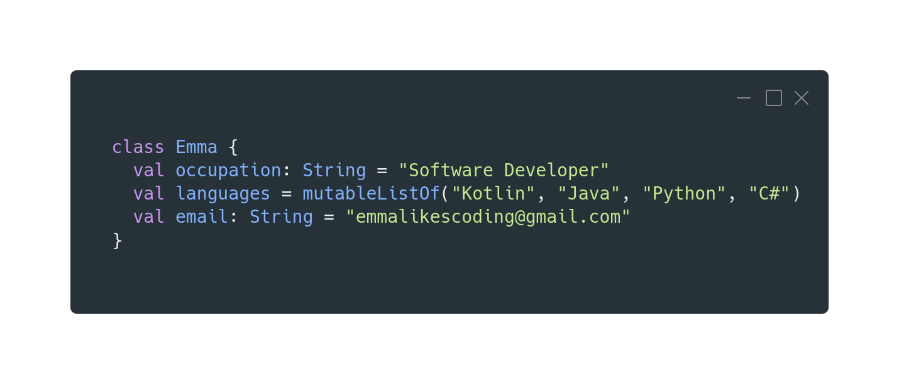
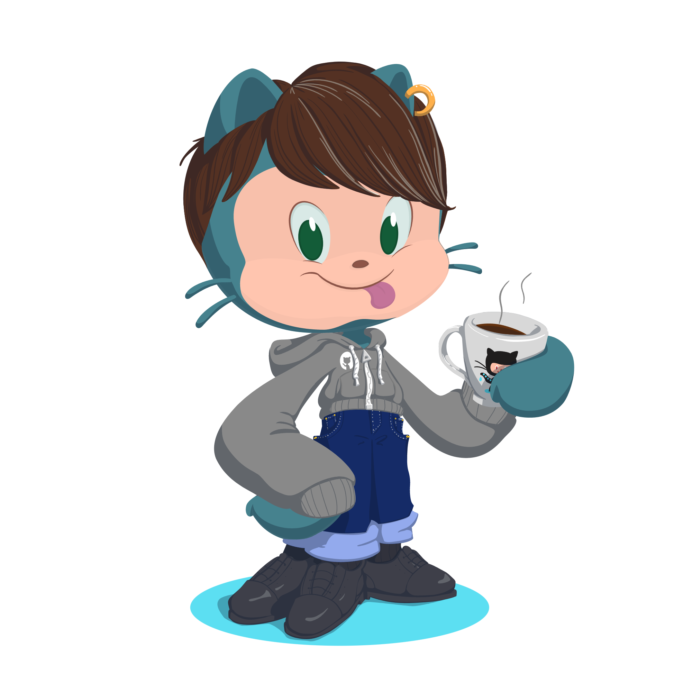

<br>

## Sobre mí

Hola, soy **Emma**. Actualmente soy estudiante de 1º de _Desarrollo de Aplicaciones Multiplataforma_ en el IES Luis Vives de Leganés. Anteriormente estudié _Diseño y Desarrollo de Videojuegos e Ingeniería de Computadores_ en la URJC, e _Ingeniería Informática_ en la UC3M.

Desde pequeña me ha interesado la tecnología y he estado siempre pegada a un ordenador. Me encanta trastear con distintos programas y sistemas operativos, y aunque no siempre entiendo lo que estoy haciendo, lo tomo como una oportunidad para aprender cosas nuevas.

Hablo español e inglés, y disfruto aprendiendo otros idiomas. Me gusta mucho el japonés aunque se me atasca un poco (todo sea por ver anime sin subtítulos). En su momento aprendí esperanto pero se me ha olvidado todo.

En mi tiempo libre me dedico a jugar videojuegos (soy un poco friki), aprender sobre nuevas tecnologías y resolver cubos de Rubik (mi récord es de 6 segundos).

*~ I use Arch btw ~*

<br>

## Tecnologías que utilizo

Empleo distintos lenguajes y tecnologías:

<div align="center">
    <a href="https://www.java.com/en/">
        
    </a>
    <a href="https://kotlinlang.org">
        
    </a>
    <a href="https://python.org">
        
    </a>
    <a href="https://en.wikipedia.org/wiki/C_(programming_language)">
        
    </a>
    <a href="https://archlinux.org">
        
    </a>
    <a href="https://www.markdownguide.org/">
        
    </a>
    <a href="https://developer.mozilla.org/en-US/docs/Web/HTML">
        
    </a>
    <a href="https://www.w3.org/XML/">
        
    </a>
    <a href="https://www.json.org/json-en.html">
        
    </a>
    <a href="https://www.mysql.com">
        
    </a>
    <a href="https://mariadb.org">
        
    </a>
    <a href="https://code.visualstudio.com">
        
    </a>
    <a href="https://www.jetbrains.com/idea">
        
    </a>
    <a href="https://www.jetbrains.com/datagrip">
        
    </a>
    <a href="https://www.virtualbox.org">
        
    </a>
    <a href="https://www.vim.org">
        
    </a>
    <a href="https://git-scm.com">
        
    </a>
    <a href="https://github.com">
        
    </a>
    <a href="https://www.gitkraken.com">
        
    </a>
    <a href="https://www.tabnine.com">
        
    </a>
</div>

<br><br>

<!--START_SECTION:waka-->

```text
From: 10 March 2023 - To: 09 April 2023

Total Time: 16 hrs 14 mins

Kotlin           13 hrs 15 mins  ####################>····   81.57 %
Markdown         56 mins         #>·······················   05.81 %
CSV/TSV          33 mins         #························   03.43 %
HTML             30 mins         #························   03.17 %
GitIgnore file   18 mins         >························   01.88 %
Properties       16 mins         >························   01.73 %
```

<!--END_SECTION:waka-->

<br><br>

<div align="center">
    <h2>Contacto</h2>
    <a href="https://www.linkedin.com/in/emma-fern%C3%A1ndez-barranco-583881251/">
        
    </a>
    <a href="https://twitter.com/emmalikescoding">
        
    </a>
</div>