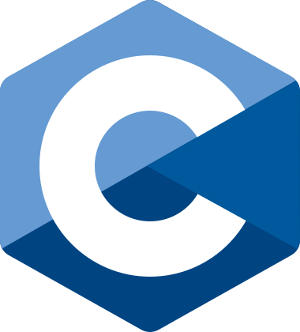
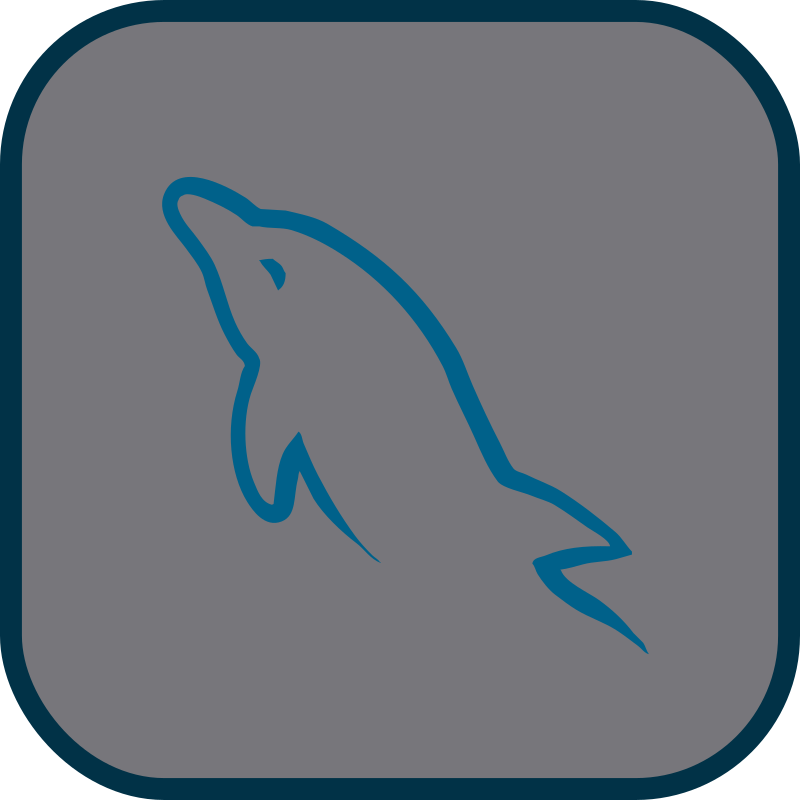
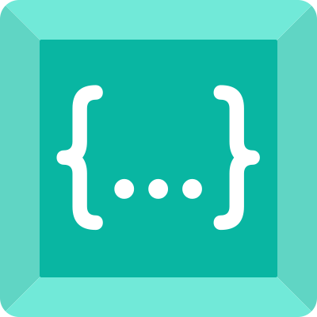

<br>

## Sobre mí

Hola, soy **Emma**. Actualmente soy estudiante de 2º de **DAM** en el IES Luis Vives de Leganés. Anteriormente estudié _Diseño y Desarrollo de Videojuegos e Ingeniería de Computadores_ en la URJC, e _Ingeniería Informática_ en la UC3M.

Desde pequeña me ha interesado la tecnología y he estado siempre pegada a un ordenador. Me encanta trastear con distintos programas y sistemas operativos, y aunque no siempre entiendo lo que estoy haciendo, lo tomo como una oportunidad para aprender cosas nuevas.

Hablo español e inglés, y disfruto aprendiendo otros idiomas. Me gusta mucho el japonés aunque se me atasca un poco. En su momento aprendí esperanto pero se me ha olvidado todo.

En mi tiempo libre me dedico a jugar videojuegos, aprender sobre nuevas tecnologías y resolver cubos de Rubik (mi récord es de 6 segundos).

*~ I use Arch btw ~*

<br>

## Tecnologías que utilizo

Empleo distintos lenguajes y tecnologías para mis proyectos:

### Lenguajes

<div align="center">
    <a href="https://www.java.com/en">
        
    </a>
    <a href="https://kotlinlang.org">
        
    </a>
    <a href="https://learn.microsoft.com/en-us/dotnet/csharp">
        
    </a>
    <a href="https://python.org">
        
    </a>
    <a href="https://www.rust-lang.org/">
        
    </a>
    <a href="https://en.wikipedia.org/wiki/C_(programming_language)">
        
    </a>
    <a href="https://developer.mozilla.org/en-US/docs/Web/HTML">
        
    </a>
    <a href="https://developer.mozilla.org/es/docs/Web/CSS">
        
    </a>
    <a href="https://developer.mozilla.org/es/docs/Web/JavaScript">
        
    </a>
    <a href="https://www.markdownguide.org/">
        
    </a>
    <a href="https://www.w3.org/XML/">
        
    </a>
    <a href="https://www.json.org/json-en.html">
        
    </a>
</div>

### Bases de datos
<div align="center">
    <a href="https://www.mysql.com">
        
    </a>
    <a href="https://mariadb.org">
        
    </a>
    <a href="https://sqlite.org">
        
    </a>
    <a href="https://www.mongodb.com/">
        
    </a>
</div>

### IDEs y editores de texto

<div align="center">
    <a href="https://www.jetbrains.com/idea">
        
    </a>
    <a href="https://www.jetbrains.com/pycharm">
        
    </a>
    <a href="https://www.jetbrains.com/datagrip">
        
    </a>
    <a href="https://developer.android.com/studio">
        
    </a>
    <a href="https://code.visualstudio.com">
        
    </a>
    <a href="https://visualstudio.microsoft.com">
        
    </a>
    <a href="https://www.vim.org">
        
    </a>
</div>

### Sistemas operativos

<div align="center">
    <a href="https://en.wikipedia.org/wiki/Linux">
        
    <a href="https://archlinux.org">
    
    <a href="https://www.ubuntu.com">
        
    </a>
    <a href="https://www.microsoft.com/en-us/windows/">
        
    </a>
</div>

### Otras tecnologías

<div align="center">
    <a href="https://www.virtualbox.org">
        
    </a>
    <a href="https://git-scm.com">
        
    </a>
    <a href="https://github.com">
        
    </a>
    <a href="https://www.gitkraken.com">
        
    </a>
    <a href="https://codeium.com/">
        
    </a>
</div>

<br><br>

<!--START_SECTION:waka-->

```txt
From: 07 May 2024 - To: 06 June 2024

Total Time: 0 secs

No activity tracked
```

<!--END_SECTION:waka-->

<br><br>

<div align="center">
    <h2>Contacto</h2>
    <a href="https://www.linkedin.com/in/emma-fern%C3%A1ndez-barranco-583881251/">
        
    </a>
    <a href="https://twitter.com/emmalikescoding">
        
    </a>
</div>
